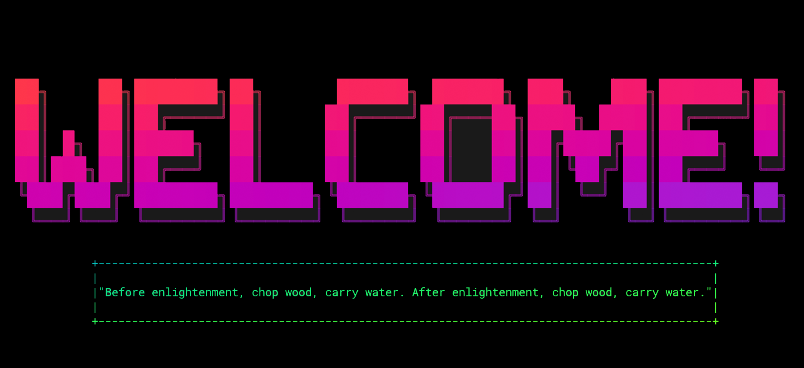

██╗    ██╗███████╗██╗      ██████╗ ██████╗ ███╗   ███╗███████╗██╗
██║    ██║██╔════╝██║     ██╔════╝██╔═══██╗████╗ ████║██╔════╝██║
██║ █╗ ██║█████╗  ██║     ██║     ██║   ██║██╔████╔██║█████╗  ██║
██║███╗██║██╔══╝  ██║     ██║     ██║   ██║██║╚██╔╝██║██╔══╝  ╚═╝
╚███╔███╔╝███████╗███████╗╚██████╗╚██████╔╝██║ ╚═╝ ██║███████╗██╗
 ╚══╝╚══╝ ╚══════╝╚══════╝ ╚═════╝ ╚═════╝ ╚═╝     ╚═╝╚══════╝╚═╝

+--------------------------------------------------------------------------------------------+
|                                                                                            |
|"Before enlightenment, chop wood, carry water. After enlightenment, chop wood, carry water."|
|                                                                                            |
+--------------------------------------------------------------------------------------------+

Hey there 👋

I’m Devon, senior engineer with over 15 years of professional experience as a software and data engineer. I’m naturally entrepreneurial and at my best solving complex, intransigent problems. In working relationships I value integrity, consistency and communication, and feel most comfortable connecting and delivering value between technical, business and creative leadership. I believe excellent work comes from excellent teams, and excellent teams are founded on the free sharing of ideas, constructive debate, and trust. 

Want to know more about me? [Check out my portfolio.](https://devonwalshe.github.io/)

## &#x1f4c8; GitHub Stats

 

 

<!-- ## 💼 Skills -->

 -->

<!-- 
Here are some ideas to get you started:

- 🔭 I’m currently working on ...
- 🌱 I’m currently learning ...
- 👯 I’m looking to collaborate on ...
- 🤔 I’m looking for help with ...
- 💬 Ask me about ...
- 📫 How to reach me: ...
- 😄 Pronouns: ...
- ⚡ Fun fact: ... -->
